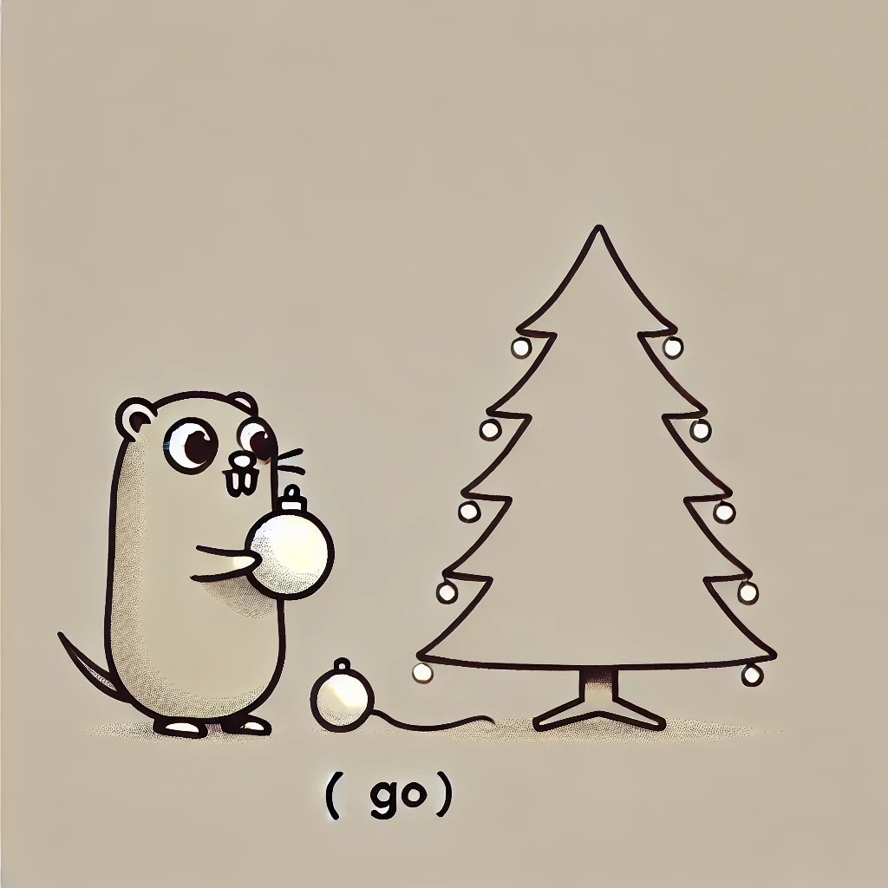

# Advent of Code 2024 (Golang)

# Goals

* Solve some AOC in Golang.
* Finish it for once!
* Tie it to algorithms and other resources.

# Progress

|                     Day                      | Part 1 | Part 2 |                       Comments                        |
|:--------------------------------------------:|:------:|:------:|:-----------------------------------------------------:|
| [Day 1](https://adventofcode.com/2024/day/1) |   ⭐    |   ⭐    |                [Easy!](day1/README.md)                |
| [Day 2](https://adventofcode.com/2024/day/2) |   ⭐    |   ⭐    |    [Problems should be composed.](day2/README.md)     |
| [Day 3](https://adventofcode.com/2024/day/3) |   ⭐    |   ⭐    | [Sometimes subproblems sustain state](day3/README.md) |
| [Day 4](https://adventofcode.com/2024/day/4) |   ⭐    |   ⭐    |          [Read your prompts](day4/README.md)          |
| [Day 5](https://adventofcode.com/2024/day/5) |   ⭐    |   ⭐    |        [Squinting at indexes](day5/README.md)         |
| [Day 6](https://adventofcode.com/2024/day/6) |   ⭐    |   ⭐    |          [EnterPrize GoLang](day6/README.md)          |

